<div align="center">


# FloodGuard

### Hyperlocal intelligence for flash-flood prediction, risk & rescue — Wayanad, Kerala

**Smart India Hackathon 2026 · Problem Statement ID 26192**<br/>
*Flash Flood Prediction System for Hilly Regions using Multi-Source Data* · **Team Tech Mavericks**

[](https://floodguard.techmavericks.me)
[](https://floodguard.techmavericks.me/app)
[](https://floodguard.techmavericks.me/emergency)
[](https://api.techmavericks.me/docs)

[](https://github.com/ABDULMUNAFZ/Hyperlocal-Intelligence-for-Flash-Flood-Prediction-Risk--Response/actions/workflows/ci.yml)
[](https://github.com/ABDULMUNAFZ/Hyperlocal-Intelligence-for-Flash-Flood-Prediction-Risk--Response/actions/workflows/backend-deploy.yml)
[](LICENSE)


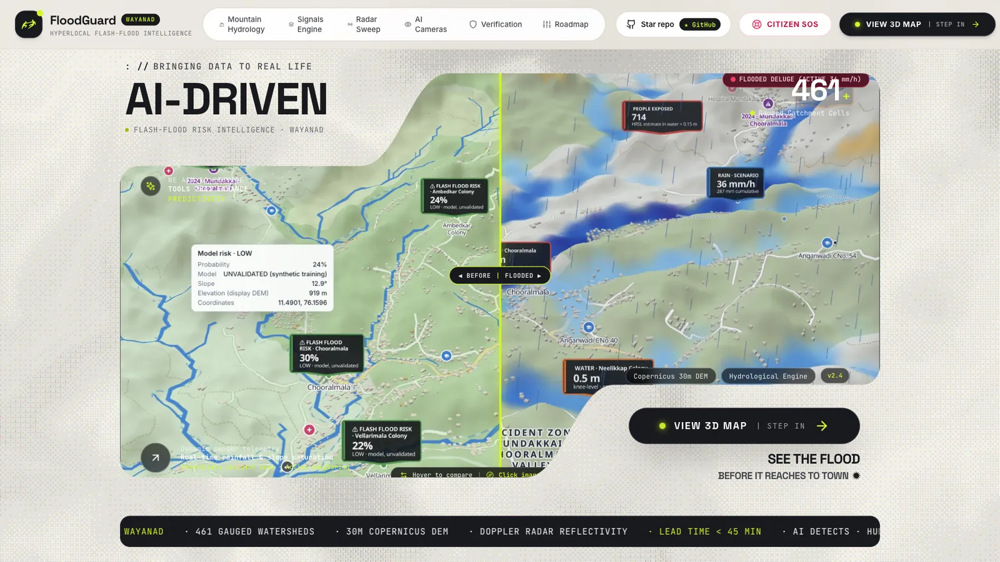

</div>

---

## Table of contents

1. [Why FloodGuard](#-why-floodguard)
2. [Live links](#-live-links)
3. [Screenshots](#-screenshots)
4. [Features](#-features)
5. [How to use it](#-how-to-use-it)
6. [Tech stack](#-tech-stack)
7. [Architecture](#-architecture)
8. [Wireframes](#-wireframes)
9. [Science & data](#-science--data)
10. [Getting started (local)](#-getting-started-local)
11. [Configuration](#-configuration)
12. [AI Model Observability](#-ai-model-observability)
13. [API overview](#-api-overview)
14. [Deployment](#-deployment)
15. [Performance](#-performance)
16. [Testing](#-testing)
17. [Project structure](#-project-structure)
18. [Limitations & honesty](#-limitations--honesty)
19. [Roadmap](#-roadmap)
20. [Contributing](#-contributing)
21. [License](#-license)
22. [Acknowledgements](#-acknowledgements)

---

## 🌊 Why FloodGuard

On **30 July 2024** the Mundakkai–Chooralmala landslides in Wayanad took **200+ lives** within hours of intense rain. In hilly districts, water runs off steep slopes into valleys in well under an hour, while warnings are usually issued for whole districts and arrive too late to act on at street level.

**FloodGuard closes the loop from _rain → risk → warning → evacuation → rescue_ at 30 m scale:**

| | Problem today | FloodGuard |
|---|---|---|
| 🗺️ **Scale** | District-level warnings | Street / 30 m micro-zones on a 3D digital twin |
| ⏱️ **Speed** | Warnings arrive late | Live rain + terrain → risk in seconds; what-if simulation in minutes |
| 📍 **Targeting** | Everyone or no one is alerted | PostGIS geofence: push alerts only to people inside the danger area |
| 🆘 **Rescue** | Calls and messages scattered | Citizens pin GPS + head-count; responders see them live on the map |
| 🏫 **Evacuation** | "Go to higher ground" | Nearest verified safe location + walking route; arrival confirmed by GPS |
| 🔍 **Trust** | Black-box numbers | Every output labelled OFFICIAL · MODEL · SIMULATION · USER REPORTED · DEMO |

---

## 🔗 Live links

| What | Link |
|---|---|
| 🏠 Landing page | **https://floodguard.techmavericks.me** (also https://www.techmavericks.me) |
| 🗺️ 3D command center (map) | https://floodguard.techmavericks.me/app |
| 🆘 Citizen emergency app (installable PWA) | https://floodguard.techmavericks.me/emergency |
| 🛡️ Admin / responder console | https://floodguard.techmavericks.me/app → **Responder** → **RESCUE PEOPLE** |
| ⚙️ REST API | https://api.techmavericks.me/api/v1 |
| 📘 Interactive API docs (Swagger) | https://api.techmavericks.me/docs |
| ❤️ Health (full component check) | https://api.techmavericks.me/api/v1/health |
| 💻 Source code | https://github.com/ABDULMUNAFZ/Hyperlocal-Intelligence-for-Flash-Flood-Prediction-Risk--Response |
| 🚀 Deployment guide | [docs/DEPLOYMENT.md](docs/DEPLOYMENT.md) |
| 🚨 Emergency system guide | [docs/EMERGENCY_RESPONSE.md](docs/EMERGENCY_RESPONSE.md) |

> Responder accounts are never self-registered. They are provisioned by an administrator
> (see [Getting started](#-getting-started-local)).

---

## 📸 Screenshots

<table>
  <tr>
    <td width="50%">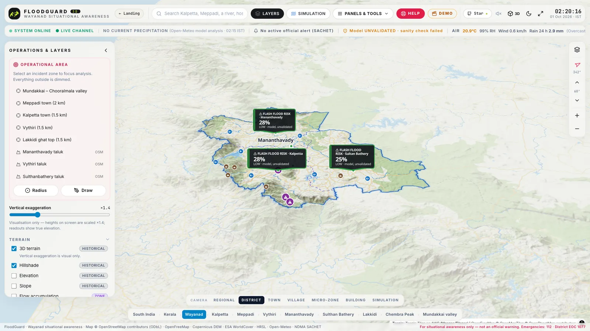<br/><sub><b>3D district map</b> — live flash-flood risk signs, rain, 3D terrain</sub></td>
    <td width="50%">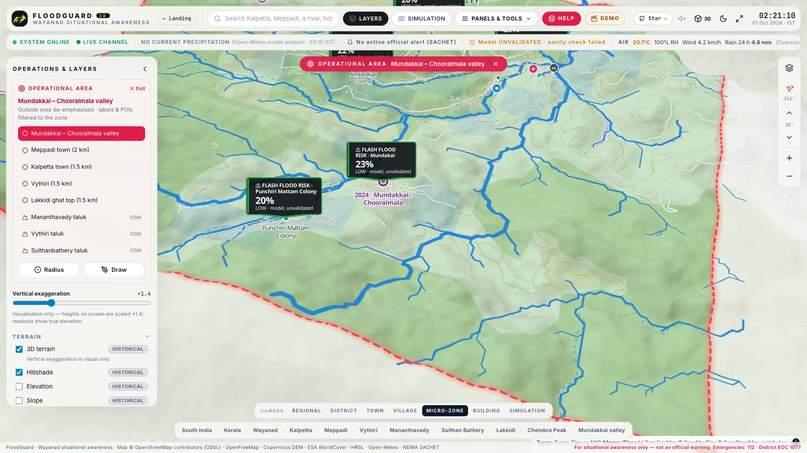<br/><sub><b>Micro-zone</b> — Mundakkai–Chooralmala valley, rivers, risk at 30 m</sub></td>
  </tr>
  <tr>
    <td width="50%">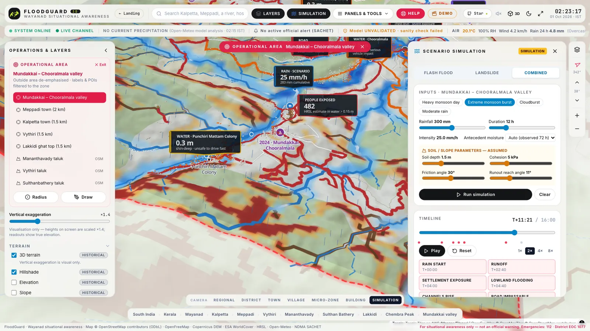<br/><sub><b>Simulation</b> — 2-D flood depth, people exposed, landslide susceptibility, timeline</sub></td>
    <td width="50%">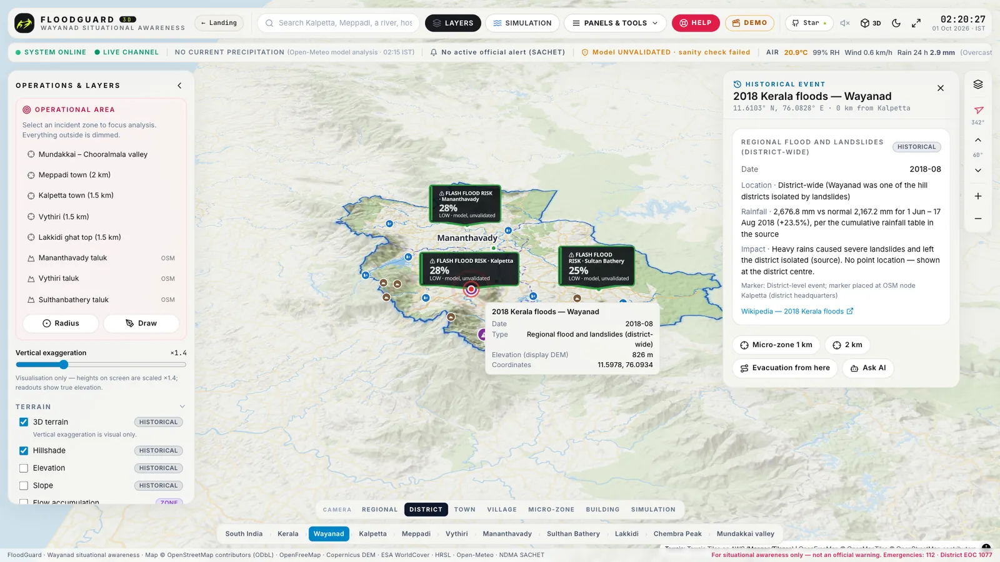<br/><sub><b>Location intelligence</b> — prediction, terrain, weather, history, nearby facilities</sub></td>
  </tr>
  <tr>
    <td width="50%">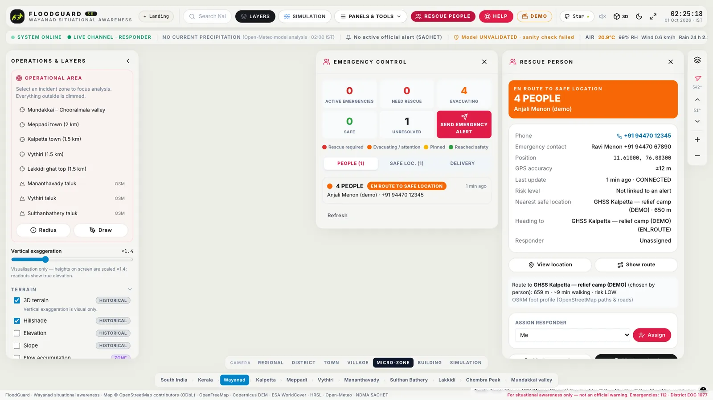<br/><sub><b>Responder console</b> — who needs rescue, contact, GPS, destination, route, assign</sub></td>
    <td width="50%">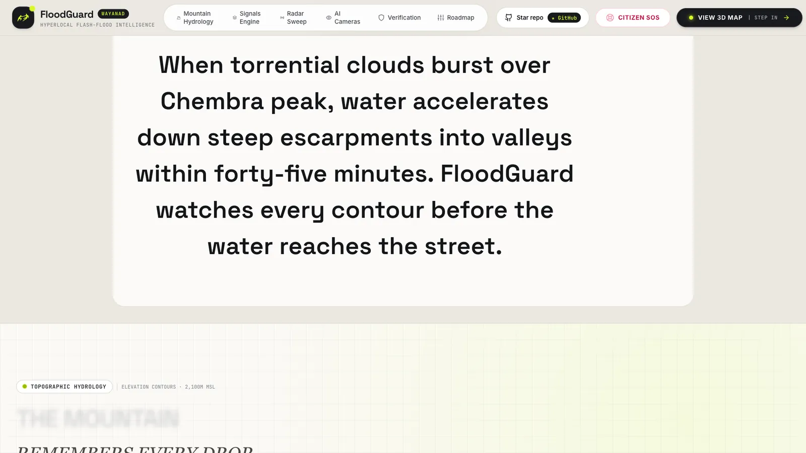<br/><sub><b>Landing page</b> — the story of a flash flood, section by section</sub></td>
  </tr>
</table>

**Citizen emergency app (installable PWA)** — register → *I NEED RESCUE* → nearest safe place → live walking route → **✓ YOU ARE SAFE** (GPS-verified):

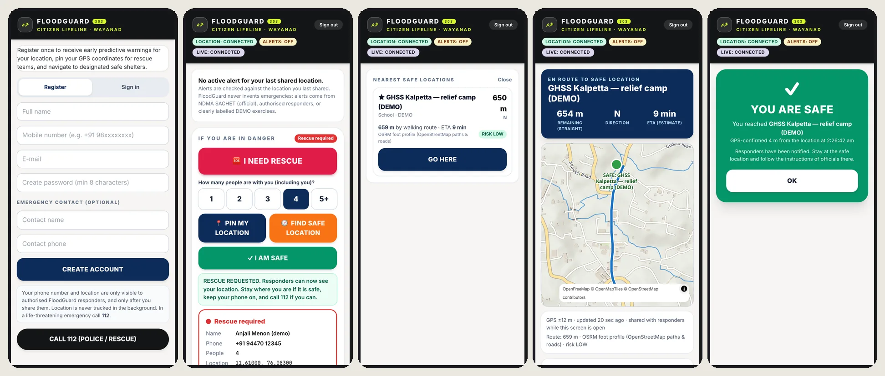

---

## ✨ Features

| | Feature | What it does |
|---|---|---|
| 🏔️ | **3D digital twin** | Real terrain (Copernicus 30 m DEM), 3D buildings, rivers, roads, POIs — South India → district → village → building, with a cinematic camera journey |
| 🌧️ | **Live weather** | Current & forecast rainfall grid (Open-Meteo), animated rain overlay, 72 h antecedent rain |
| 🤖 | **ML flash-flood risk** | 17-feature ensemble (Random Forest + XGBoost + logistic) with top drivers per location — *clearly labelled unvalidated* |
| 🌊 | **Physics simulation** | SCS-CN runoff → 2-D shallow-water routing (LISFLOOD-FP style) → flood depth / velocity / hazard hour by hour |
| ⛰️ | **Landslide model** | Infinite-slope factor of safety (SHALSTAB) + debris runout; combined flood + landslide scenarios |
| 👥 | **Impact analysis** | People (HRSL), buildings, roads, bridges and facilities exposed in any zone |
| 🚨 | **Official alerts** | NDMA **SACHET** CAP feed polled every 5 min; Severe/Extreme alerts for Wayanad are pushed automatically |
| 📣 | **Responder alerts** | Draw an area → preview affected users → confirm → geofenced **Web Push** + live stream; DEMO mode for drills |
| 🆘 | **Citizen rescue** | *PIN MY LOCATION*, *I NEED RESCUE* (+ head-count), *I AM SAFE* — real device GPS, never faked |
| 🏫 | **Safe evacuation** | Responder-designated safe locations, nearest by PostGIS, OSRM walking route, route risk, live journey |
| ✅ | **Verified arrival** | *REACHED HERE* is accepted only within 200 m (+ GPS accuracy) of the destination |
| 🛡️ | **Rescue dashboard** | Live red/orange/yellow/green people markers, assign responders, resolve, audit trail |
| 📱 | **PWA** | Installable on Android/iOS/desktop, offline shell, push notifications with vibration |
| 🔐 | **Security** | JWT + role-based access, audit logs, retention limits, secrets in AWS Secrets Manager, HTTPS everywhere |

---

## 🧭 How to use it

### 👤 Citizens — stay safe

1. Open **https://floodguard.techmavericks.me/emergency** on your phone and **install** it
   (Android: *Install app*; iPhone: *Share → Add to Home Screen*).
2. **Register** with your name, phone and an emergency contact.
3. Tap **ALLOW EMERGENCY ALERTS** and **SHARE MY LOCATION** so warnings for *your* area reach you.
4. When an alert arrives, or whenever you are in danger:
   - **🆘 I NEED RESCUE** — sends your GPS position and how many people are with you to responders.
   - **🧭 FIND SAFE LOCATION → GO HERE → I'M GOING** — follow the walking route; keep the screen open.
   - **✓ REACHED HERE** — confirms you are safe (checked against your GPS).
   - **✓ I AM SAFE** — tells responders to prioritise others.
5. In a life-threatening emergency, **call 112**.

### 🛡️ Responders / DDMA — coordinate

1. Open **https://floodguard.techmavericks.me/app** → **Responder** → sign in (provisioned account).
2. Click **RESCUE PEOPLE**: live counts (need rescue · evacuating · safe) and every person as a coloured marker.
3. Click a person → **View location**, **Show route**, **Assign responder**, **Mark evacuating / resolved**.
4. **Safe loc.** tab → click the exact building on the map → **Designate** (name, capacity, authority).
5. **Command → Create alert** → choose area & severity → review *affected users* → **SEND ALERT**.
   Tick **DEMO** for drills — citizens see *"DEMO EMERGENCY — NOT A REAL WARNING"*.

### 📊 Planners / analysts — understand risk

1. Pick an **operational area** (e.g. *Mundakkai – Chooralmala valley*) or draw your own.
2. Open **Risk** for 30 m risk cells and drivers; click any point for its prediction and terrain.
3. Open **Simulation** → choose *flash flood · landslide · combined* and a rainfall scenario → **Run**.
4. Scrub the **timeline** to see depth, people exposed, impassable roads and slope failures hour by hour.
5. Use **Evacuation** for risk-aware routes, and **AI** to ask *"why is this area at high risk?"*.

---

## 🧰 Tech stack

<p align="center">
  
</p>

| Layer | Technologies |
|---|---|
| **Frontend** |           |
| **Backend** |       |
| **Geo & science** |      |
| **Machine learning** |    |
| **Data stores** |    |
| **Cloud & DevOps** |        |

---

## 🏗️ Architecture

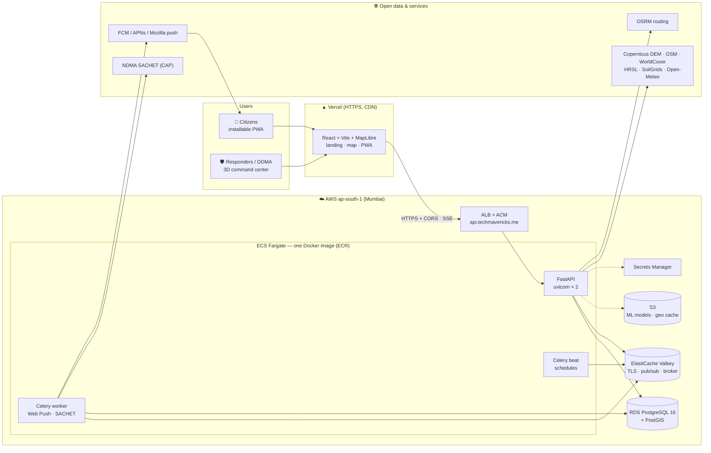

### Emergency response loop

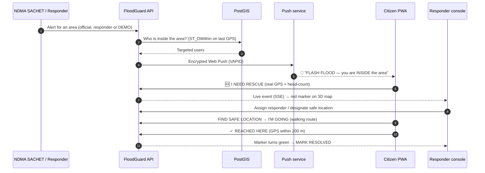

### Methodology — from rainfall to rescue

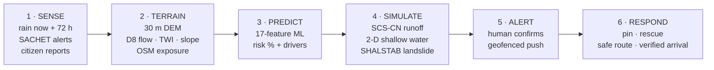

---

## 📐 Wireframes

**Landing page** (`/`)

```
┌──────────────────────────────────────────────────────────────────────────┐
│ [logo] FloodGuard  Mountain·Signals·Radar·Cameras [CITIZEN SOS] [3D MAP] │
├──────────────────────────────────────────────────────────────────────────┤
│  // BRINGING DATA TO REAL LIFE                                           │
│  AI-DRIVEN                         ┌───────────────────────────────────┐ │
│  flash-flood risk intelligence     │  BEFORE  │◄──drag──►│  FLOODED    │ │
│                                    │  (hero1)            (hero2)       │ │
│                                    │   risk signs · people exposed     │ │
│                                    └───────────────────────────────────┘ │
│                          [ ● VIEW 3D MAP | STEP IN → ]                   │
├──────────────────────────────────────────────────────────────────────────┤
│ 01 Mountain hydrology · 02 Signals · 03 Weather · 04 Cameras · 05 Human  │
│ 06 Place intel · 07 Simulation · 08 Citizen app · 09 Command preview     │
│ Footer: SIH 2026 · PS 26192 · Team Tech Mavericks                        │
└──────────────────────────────────────────────────────────────────────────┘
```

**3D command center** (`/app`)

```
┌──────────────────────────────────────────────────────────────────────────┐
│ FLOODGUARD 3D │ search… │ LAYERS  SIMULATION  PANELS▾ │ RESCUE PEOPLE    │
│ ● SYSTEM ONLINE ● LIVE │ rain now │ SACHET │ model │ weather │ mode      │
├───────────────┬──────────────────────────────────────────┬───────────────┤
│ OPERATIONS &  │                                          │ CONTEXT PANEL │
│ LAYERS        │          3D MAP (MapLibre + terrain)     │ location ·    │
│ • zone presets│   risk signs · rain · rivers · 3D bldgs  │ prediction ·  │
│ • radius/draw │   people markers (responders only)       │ terrain ·     │
│ • terrain     │                                          │ weather ·     │
│ • weather     │                                          │ facilities    │
│ • hazards     │                                          │  — or —       │
│ • exaggeration│                                          │ SIMULATION /  │
│               │                                          │ RESCUE PERSON │
├───────────────┴──────────────────────────────────────────┴───────────────┤
│ CAMERA · REGIONAL · DISTRICT · TOWN · VILLAGE · MICRO-ZONE · BUILDING    │
│ South India › Kerala › Wayanad › Meppadi › … › Mundakkai valley          │
└──────────────────────────────────────────────────────────────────────────┘
```

**Citizen PWA** (`/emergency`)

```
┌─────────────────────────┐  ┌─────────────────────────┐  ┌─────────────────────────┐
│ FLOODGUARD  [Sign out]  │  │ NEAREST SAFE LOCATIONS  │  │ EN ROUTE TO SAFE PLACE  │
│ LOCATION ● ALERTS ● LIVE│  │ ★ GHSS relief camp  650m│  │ 654 m   N    9 min      │
├─────────────────────────┤  │   659 m walk · 9 min    │  ├─────────────────────────┤
│ ⚠ ALERT CARD (if any)   │  │   RISK LOW              │  │                         │
│ [   🆘 I NEED RESCUE   ]│  │   [     GO HERE     ]   │  │   map: route + you +    │
│ people: 1 2 3 4 5+      │  │                         │  │   destination           │
│ [📍 PIN] [🧭 SAFE PLACE]│  │  (only verified, never  │  │                         │
│ [    ✓ I AM SAFE     ]  │  │   invented locations)   │  ├─────────────────────────┤
│ pinned card: name,      │  │                         │  │ [   ✓ REACHED HERE   ]  │
│ phone, GPS, accuracy    │  │                         │  │ [   🆘 I NEED RESCUE ]  │
└─────────────────────────┘  └─────────────────────────┘  └─────────────────────────┘
```

---

## 🔬 Science & data

| Component | Method | Reference |
|---|---|---|
| Runoff | SCS Curve Number with antecedent moisture | USDA NRCS TR-55 (1986) |
| Flood routing | 2-D local-inertial shallow water | Bates, Horritt & Fewtrell (2010), *J. Hydrology* 387 |
| Hazard rating | HR = d·(v + 0.5) + DF | EA / Defra FD2320 (2006) |
| Landslide | Infinite-slope factor of safety | Montgomery & Dietrich (1994) SHALSTAB; Pack et al. (1998) SINMAP |
| Debris runout | Travel-angle criterion | Corominas (1996) |
| ML risk | Random Forest + XGBoost + logistic ensemble | Breiman (2001); Chen & Guestrin (2016) |

| Dataset | Use | License / terms |
|---|---|---|
| Copernicus GLO-30 DEM | Terrain, slope, drainage | © ESA / Airbus, Copernicus licence |
| AWS Terrain Tiles (Mapzen) | 3D map terrain | Open data (see attribution) |
| OpenStreetMap | Buildings, roads, rivers, facilities | ODbL — © OpenStreetMap contributors |
| ESA WorldCover 2021 | Land cover (10 m) | CC BY 4.0 |
| Meta / CIESIN HRSL | Population (30 m) | CC BY 4.0 |
| ISRIC SoilGrids 2.0 | Soil texture | CC BY 4.0 |
| Open-Meteo | Live & forecast rain, climate | CC BY 4.0 |
| NDMA SACHET | Official CAP alerts | Government of India |
| OSRM (FOSSGIS) | Walking / driving routes | ODbL data, public demo server |
| OpenFreeMap | Vector base map | © OpenMapTiles, © OSM contributors |

---

## 🚀 Getting started (local)

**Prerequisites:** [Docker Desktop](https://www.docker.com/products/docker-desktop/) · Git · (optional) Node 20+ and Python 3.12 for running outside Docker.

```bash
git clone https://github.com/ABDULMUNAFZ/Hyperlocal-Intelligence-for-Flash-Flood-Prediction-Risk--Response.git floodguard
cd floodguard
cp .env.example .env          # then edit secrets (see Configuration)
docker compose up -d          # postgres+postgis, redis, backend, celery worker & beat, frontend, nginx
```

| Service | URL |
|---|---|
| Frontend (Vite dev server) | http://localhost:5173 |
| Everything through nginx | http://localhost |
| API + Swagger docs | http://localhost:8000/docs |

Create a local responder/admin account (the password is generated into the git-ignored `backend/.cache/`):

```bash
docker compose exec backend python scripts/create_responder.py --email ops@floodguard.local --role admin --generate-dev-password
```

Generate Web Push (VAPID) keys for notifications:

```bash
docker compose exec backend python scripts/generate_vapid_keys.py --subject mailto:you@example.org >> .env
```

Useful commands:

```bash
docker compose ps                                        # health of all services
docker compose logs -f backend                           # API logs
docker compose exec backend alembic upgrade head         # apply migrations
docker compose exec backend python scripts/emergency_smoke.py --full   # end-to-end emergency test
```

---

## ⚙️ Configuration

Copy [`.env.example`](.env.example) to `.env`. The most important settings:

| Variable | Purpose | Example |
|---|---|---|
| `SECRET_KEY` | JWT signing key | *long random string* |
| `DATABASE_URL` | PostgreSQL + PostGIS | `postgresql+asyncpg://…@postgres:5432/floodguard` |
| `REDIS_URL` | SSE pub/sub + Celery broker | `redis://redis:6379/0` (prod: `rediss://…`) |
| `CORS_ORIGINS` | Allowed frontend origins (JSON list) | `["https://floodguard.techmavericks.me"]` |
| `VAPID_PUBLIC_KEY` / `VAPID_PRIVATE_KEY` / `VAPID_SUBJECT` | Web Push | from `generate_vapid_keys.py` |
| `EMERGENCY_ARRIVAL_RADIUS_M` | *REACHED HERE* radius | `200` |
| `EMERGENCY_AUTO_OFFICIAL_ALERTS` | Auto-push SACHET Severe/Extreme | `true` |
| `ROUTING_FOOT_BASE_URL` | OSRM walking routes | `https://routing.openstreetmap.de/routed-foot` |
| `MODEL_ARTIFACTS_S3_URI` / `GEO_CACHE_S3_URI` | Production model + geo cache in S3 | `s3://bucket/models` |
| `VITE_API_BASE_URL` | Frontend → API | `https://api.techmavericks.me/api/v1` |

> 🔒 Never commit `.env`. In production, secrets live in **AWS Secrets Manager** and **Vercel environment variables**.

---

## 🧠 AI Model Observability

FloodGuard can optionally stream its flood-risk predictions to **[Arize AI](https://arize.com/)** so the model can be watched in production: what it is fed, what it predicts, how fast, and whether the inputs drift away from what it was trained on. It is **monitoring only**. It never changes a prediction, and FloodGuard works the same with it off, misconfigured or unreachable.

**What is monitored.** Each prediction from `InferenceEngine.predict` / `predict_batch` (the single path behind `/prediction/predict`, zone risk, risk signs and scenarios):

| Sent to Arize | Detail |
|---|---|
| Features | the 17 model inputs (rainfall 1/6/24/72 h, weather, elevation, slope, TWI, soil, land cover, population density, historical flood count) |
| Prediction | flood probability (score) and `flood` / `no_flood` label at 0.5 |
| Tags | risk level, inference latency (ms), model used, deployment environment |
| Model | `ARIZE_MODEL_ID`, registered model version, binary classification, production environment |

Drift, distributions and performance are **computed by Arize monitors**. The dashboard links to them and does not re-create them.

**Architecture.**

```
prediction request ─▶ InferenceEngine.predict() ─▶ response (unchanged)
                              │ after the result is built; never raises
                              ▼
                  in-memory buffer (bounded, 5 000 rows)
                              │ background task every 10 s
                ┌─────────────┴──────────────┐
                ▼                            ▼
   Redis daily counters            Arize SDK (worker thread, timeout)
   (dashboard stats)               batch ≤ 1 000 rows; batch jobs sampled to 200
                ▼
   GET /api/v1/model-observability/summary ─▶ "AI Model Intelligence" dashboard panel
```

Exports run off the request path. Arize errors (timeout, unreachable, 401/403, 404, 429, 5xx, SDK missing) are caught, logged by type only, and shown on the panel as *Arize AI temporarily unavailable*. A 429 pauses exports for 60 s.

**Enabling.** Create a space in Arize, then set these **on the backend only** (local `backend/.env`, or AWS Secrets Manager in production):

| Variable | Purpose | Default |
|---|---|---|
| `ARIZE_ENABLED` | Turn exports on | `false` |
| `ARIZE_API_KEY` | Arize API key (secret) | — |
| `ARIZE_SPACE_ID` | Arize space ID | — |
| `ARIZE_MODEL_ID` | Model name in Arize | `FloodGuard-Risk-Prediction` |
| `ARIZE_TIMEOUT` | Per-export timeout (seconds) | `10` |

> 🔒 Never put Arize keys in `VITE_*` variables, the frontend, the repo or a Docker image. The browser only ever sees aggregate counts and connection state.

**Running without Arize.** Leave `ARIZE_ENABLED=false` (the default). Predictions, stats and the panel keep working, and the panel shows *Arize AI not connected* with a connect prompt.

**Privacy.** Only model inputs and outputs are sent. No names, phone numbers, emails, tokens, user IDs or coordinates/addresses. Prediction IDs are random UUIDs.

**Limitations.**
- **No ground truth yet.** Observed flood outcomes are not logged as actuals, so Arize shows drift and prediction distributions, not accuracy. Nothing is fabricated. Next step: return the prediction ID to clients and log verified outcomes against it.
- Location is deliberately not sent, so Arize cannot slice drift by region.
- Batch jobs (zone grids, scenarios) are fully counted but sampled to 200 rows per batch for export.
- Pinned to `arize==7.54.0`: Arize 8.x requires NumPy 2, and the backend pins NumPy 1.26.
- The model is still trained on synthetic data (see [Limitations & honesty](#-limitations--honesty)). Observability shows how it behaves; it does not validate it.

Tests: `cd backend && pytest tests/test_model_observability.py` (Arize is mocked; no account needed).

---

## 🔌 API overview

Full, interactive reference: **https://api.techmavericks.me/docs**

| Area | Endpoints (prefix `/api/v1`) | Access |
|---|---|---|
| Health | `GET /health` · `GET /health/ready` · `GET /health/live` | public |
| Prediction | `POST /prediction/predict` · `GET /prediction/health` | public |
| Geo & terrain | `GET /geo/manifest` · `/geo/weather` · `/geo/terrain` · `/geo/rainfall-grid` · `/geo/alerts` · `/geo/layers/{name}` | public |
| Zones | `POST /geo/zone/terrain` · `/zone/osm` · `/zone/risk` · `/zone/impact` · `/zone/worldpop` | public |
| Simulation | `POST /geo/simulate/jobs` → `GET /geo/simulate/jobs/{id}` · `POST /geo/simulate/{id}/routes` | public |
| Live | `GET /live/stream` (SSE) · `GET /live/alerts/active` · `POST /live/alerts` · `POST /live/alerts/preview` | alerts: responders |
| Citizen | `GET /emergency/me` · `POST /emergency/location` · `POST /emergency/request` · `POST /emergency/nearby-safe-locations` · `POST /emergency/{id}/start-evacuation` · `POST /emergency/{id}/reached` | signed-in user (own data) |
| Push | `GET /push/config` · `POST /push/subscribe` · `POST /push/test` | signed-in user |
| Rescue | `GET /rescue/active` · `/rescue/summary` · `/rescue/{id}` · `POST /rescue/{id}/assign` · `/rescue/{id}/status` | responders (audited) |
| Safe locations | `GET /safe-locations` · `POST /safe-locations` · `POST /safe-locations/{id}/deactivate` | list: public · manage: responders |
| Evacuation | `POST /evacuation/safe-route` · `/evacuation/routes/compute` · `GET /evacuation/shelters/nearby` | public |
| AI assistant | `POST /geo/assistant` · `POST /ai/chat` | public |
| History & data | `GET /geo/historical-events` · `/historical-floods/nearby` · `/data-sources/status` | public |
| Model observability | `GET /model-observability/summary` (aggregate stats + Arize AI state) | public |
| IoT sensors | `POST /iot/register` · `POST /iot/observations` · `GET /iot/readings/latest` | sensor / responders |
| Auth | `POST /auth/register` · `POST /auth/login` · `POST /auth/refresh` · `GET /auth/me` | public |

---

## ☁️ Deployment

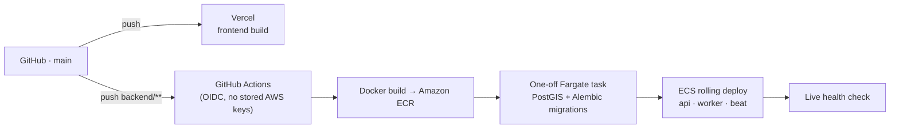

| Part | Where | Notes |
|---|---|---|
| Frontend | Vercel | SPA rewrites, PWA headers, immutable asset caching, `floodguard.techmavericks.me` |
| API | AWS ECS Fargate behind ALB | HTTPS via ACM, `api.techmavericks.me`, non-root container, health checks |
| Database | Amazon RDS PostgreSQL 16 + PostGIS 3.4 | private, encrypted, migrations in CI |
| Cache / broker | Amazon ElastiCache (Valkey) | TLS in transit |
| Assets | Amazon S3 | ML models + geo cache, pulled at container start |
| Secrets | AWS Secrets Manager / Vercel env | nothing secret in git or images |

Step-by-step: **[docs/DEPLOYMENT.md](docs/DEPLOYMENT.md)** · infrastructure script: [`infrastructure/aws/provision.sh`](infrastructure/aws/provision.sh)

---

## ⚡ Performance

Measured on the live site (headless Chrome; 3D map on an Intel UHD 630 GPU):

| Metric | Before | After |
|---|---|---|
| Landing page — main-thread blocking (desktop / mobile) | 8.4 s / 11 s | **0.1 s / 0.2 s** |
| Landing page — first content on screen (mobile, 4G) | > 8 s | **1.0 s** |
| Hero images downloaded | 7.4 MB | **0.23 MB** (responsive WebP) |
| Main JS bundle (every page, gzip) | 272 KB | **46 KB** |
| *VIEW 3D MAP* click → map on screen | seconds | **0.4 s** (prefetched) |
| 3D map — district flight | 19 fps | **41 fps** |
| 3D map — hover inspection | 19 fps | **36 fps** |

How: responsive WebP, lazy-loaded three.js/GSAP/framer-motion, idle prefetch of the map, throttled
camera telemetry and hover, no river-animation redraws during camera moves, drawing-buffer cap on
4K screens, preconnects and non-blocking fonts.

---

## 🧪 Testing

| Suite | Command | Count |
|---|---|---|
| Backend (pytest, real PostGIS + Redis) | `docker compose exec backend pytest -q tests/` | 31 |
| Frontend (vitest) | `cd frontend && npx vitest run` | 9 |
| Type check | `cd frontend && npx tsc --noEmit -p .` | — |
| Lint | `cd frontend && npx eslint src --ext ts,tsx` | — |
| End-to-end emergency (20 steps) | `python scripts/emergency_smoke.py --full` | 20 |

CI runs type-check, tests, builds and the production Docker image on every push
([ci.yml](.github/workflows/ci.yml)).

---

## 🗂️ Project structure

```
floodguard/
├── backend/                     FastAPI app (Python 3.12)
│   ├── app/
│   │   ├── api/v1/endpoints/    REST + SSE endpoints (geo, simulation, live, emergency, …)
│   │   ├── services/geo/        terrain, OSM, weather, hydrology, flood & landslide simulation
│   │   ├── services/emergency/  targeting, Web Push, routing, state machine, audit
│   │   ├── ml/                  feature engineering, training, registry, inference
│   │   ├── models/              SQLAlchemy + GeoAlchemy2 models
│   │   └── tasks/               Celery tasks (push delivery, SACHET ingest, retention)
│   ├── alembic/                 database migrations
│   ├── scripts/                 db bootstrap, responders, VAPID keys, smoke tests
│   ├── tests/                   pytest suites
│   └── Dockerfile               development + production targets
├── frontend/                    React + Vite + TypeScript
│   ├── src/pages/               LandingPage, WayanadCommandCenter, EmergencyApp, …
│   ├── src/components/Wayanad/  3D map, panels, simulation, rescue dashboard
│   ├── src/components/landing/  landing-page sections
│   ├── src/emergency/           citizen PWA (GPS, push, journey, status machine)
│   ├── public/                  manifest, service worker, icons, images, GeoJSON
│   └── vercel.json              Vercel routing + headers
├── infrastructure/aws/          provisioning script + ECS task definitions
├── .github/workflows/           CI + backend deploy
├── docs/                        deployment & emergency guides, README images
└── docker-compose.yml           local development stack
```

---

## ⚠️ Limitations & honesty

- **The ML risk model is unvalidated.** It was trained on synthetic labels and is shown as *MODEL · UNVALIDATED*; physics simulation and official alerts drive decisions until it is retrained on real event data (KSDMA / CWC / IMD).
- **FloodGuard supports — never replaces — official warnings.** Emergencies: **112** · District EOC **1077**.
- Browsers cannot track GPS in the background; location is shared when a button is pressed or while the journey screen is open.
- iOS push notifications require the PWA to be installed to the Home Screen (iOS 16.4+). Silent mode / Do Not Disturb cannot be overridden.
- Routing uses public OSRM demo servers (no SLA, no live road closures).
- Safe locations exist only when an authorised responder designates them — FloodGuard never invents shelters.

---

## 🗺️ Roadmap

- [ ] Retrain and validate the risk model with historical Wayanad event records
- [ ] SMS / Cell Broadcast fallback for areas without data connectivity
- [ ] IMD / CWC river-gauge and rain-gauge integration
- [ ] Offline map tiles for the citizen app
- [ ] Malayalam and Tamil localisation
- [ ] Extend to other Western Ghats, Himalayan and North-East districts

---

## 🤝 Contributing

1. Fork the repository and create a branch: `git checkout -b feature/my-change`
2. Run the stack with `docker compose up -d`; make your change with tests
3. Check: `npx tsc --noEmit -p frontend`, `npx vitest run`, `docker compose exec backend pytest -q`
4. Commit with a clear message and open a pull request

Please keep the project's core rule: **never fabricate data** — anything simulated, demo or unvalidated must be labelled as such.

---

## 📄 License

Licensed under the **Apache License 2.0** — see [LICENSE](LICENSE) and [NOTICE](NOTICE).
You may use, modify and distribute this software (including commercially and by government agencies),
provided you keep the license and notices. Third-party data keeps its own licence (see [Science & data](#-science--data)).

---

## 🙏 Acknowledgements

Smart India Hackathon 2026 · Ministry of Education's Innovation Cell · NDMA SACHET ·
Copernicus / ESA · OpenStreetMap contributors · Open-Meteo · ISRIC · Meta & CIESIN (HRSL) ·
MapLibre · OpenFreeMap · FOSSGIS (OSRM) · and every volunteer who maps Wayanad.

<div align="center">
<br/>
<b>Built with ❤️ by Team Tech Mavericks for the people of Wayanad</b><br/>
<sub>For situational awareness only — not an official warning. In an emergency call 112.</sub>
</div>
